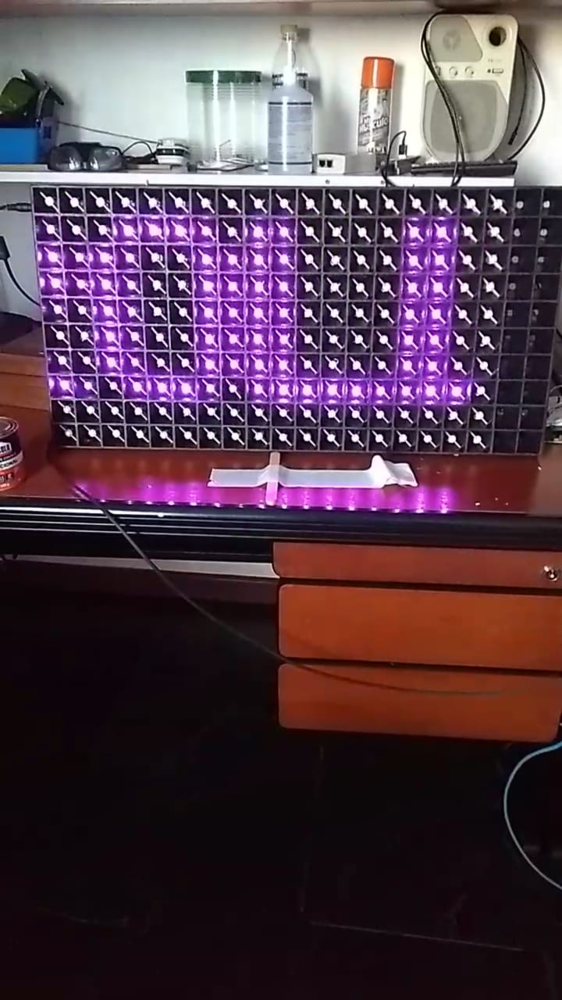

# descontrole
 code .py is a pygame script to publish mqtt when keyboard arrows is pressed, or gamepad USB axis is pressed
I use 200 ws2812b solder one by one and put then in a seed starter tray.  layout HORIZONTAL_ZIGZAG_MATRIX

